# UDA-city Heat Hazard and Socio-economic Heat-risk Report

This report summarises the focus-city SUEWS runs and the reference heat-risk bridge for all ten UDA-city neighbourhoods. UDA-city is synthetic: the numbers support comparison and workflow testing, not claims about a real place.

## Executive Summary

- Present scenario: dangerous-heat hours range from **0 to 37** hours after spin-up.
- Future +2.5 C scenario: dangerous-heat hours range from **17 to 211** hours.
- The highest-risk neighbourhood is **Fuzhou Lanes** in both scenarios because it combines the strongest heat hazard with maximum exposure and very high vulnerability.
- The hottest or most exposed neighbourhood is not automatically the highest risk: the bridge only produces high risk where hazard, exposure and vulnerability are all high.

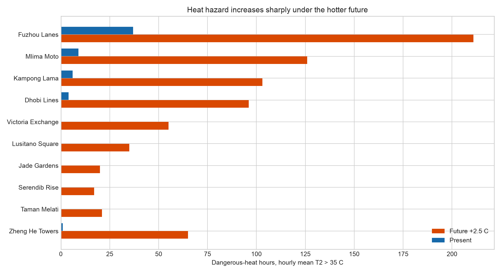

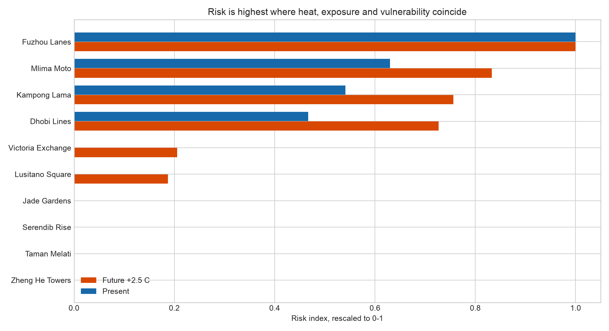

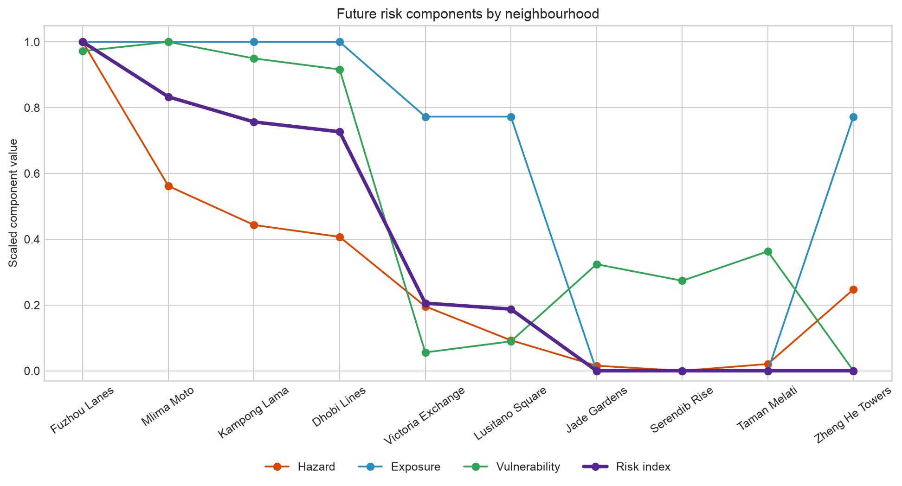

## Method

### SUEWS Simulation

The canonical UDA-city configuration represents ten neighbourhoods driven by the same hot-humid forcing. Inter-neighbourhood differences therefore come from urban form, land cover and population, not from different weather. The present scenario uses the supplied hot-humid forcing; the future scenario applies the dataset's humidity-preserving +2.5 C pseudo-warming.

The supplied dataset requires `supy >= 2026.6.5`. On this host, that wheel was only available for macOS 15 while the machine is macOS 14, so the report uses a clearly logged compatibility run with SuPy 2025.7.6. The compatibility changes are limited to schema/runtime blockers and are recorded in `analysis/focus_city/compat_changes.txt`. This is adequate for a practice report, but the judged workflow should be rerun on the recommended runtime if available.

### Heat Hazard

The reference hazard metric is **dangerous-heat hours**: the count of hours whose hourly mean 2 m air temperature (`T2`) exceeds **35 C**, after discarding the first 14 days as model spin-up. The threshold is illustrative for a hot-humid city; a humid-heat index would be a defensible improvement.

### Socio-economic Heat-risk Bridge

The risk bridge follows the UNDRR-style decomposition:

```text
risk = f(hazard, exposure, vulnerability)
```

- **Hazard**: min-max scaled dangerous-heat hours from SUEWS.
- **Exposure**: min-max scaled daytime population density.
- **Vulnerability**: min-max scaled average of fraction over 65, fraction under 5, lack of AC access, outdoor-worker fraction and deprivation index.
- **Risk index**: geometric mean of the three pillars, then rescaled to 0-1. The geometric mean is conservative: if one pillar is near zero, total risk is pulled down.

## Results by Neighbourhood

### 1. Jade Gardens (refuge)

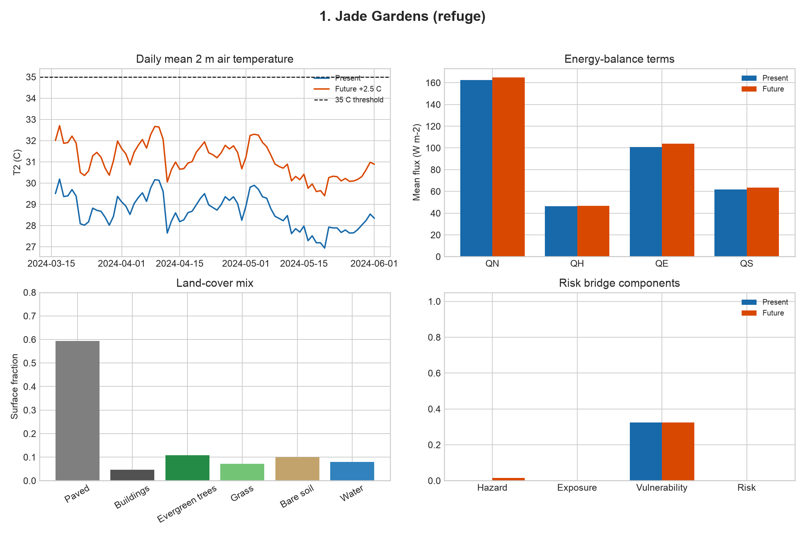

**Site description.** This site has greener land cover and lower exposure, so even when the future scenario creates dangerous-heat hours, the reference geometric bridge keeps risk low.

Physical form: plan building fraction 0.05, frontal-area index 0.02, mean building height 5.2 m. Land cover is 59% paved, 5% buildings, 18% vegetated surfaces, 10% bare soil and 8% water.

Socio-economic profile: daytime population density is 80.0 people/ha and night-time density is 100.0 people/ha. Vulnerability proxies are over-65 10%, under-5 9%, AC access 45%, outdoor workers 30% and deprivation index 0.40.

Climatological result: mean analysis-window T2 rises from 28.6 C to 31.1 C; maximum hourly T2 rises from 33.9 C to 36.4 C. Mean sensible heat flux QH changes from 46.5 to 46.7 W m-2, while latent heat flux QE changes from 101.0 to 104.1 W m-2.

Heat-risk result: dangerous-heat hours increase from **0** to **20**. The risk index changes from **0.00** (#5) to **0.00** (#7). Components in the future scenario are hazard 0.02, exposure 0.00 and vulnerability 0.32.

### 2. Serendib Rise (refuge)


**Site description.** This site has greener land cover and lower exposure, so even when the future scenario creates dangerous-heat hours, the reference geometric bridge keeps risk low.

Physical form: plan building fraction 0.07, frontal-area index 0.07, mean building height 19.7 m. Land cover is 57% paved, 7% buildings, 18% vegetated surfaces, 10% bare soil and 8% water.

Socio-economic profile: daytime population density is 80.0 people/ha and night-time density is 100.0 people/ha. Vulnerability proxies are over-65 11%, under-5 8%, AC access 50%, outdoor workers 28% and deprivation index 0.38.

Climatological result: mean analysis-window T2 rises from 28.7 C to 31.2 C; maximum hourly T2 rises from 33.7 C to 36.2 C. Mean sensible heat flux QH changes from 46.3 to 46.6 W m-2, while latent heat flux QE changes from 101.7 to 104.8 W m-2.

Heat-risk result: dangerous-heat hours increase from **0** to **17**. The risk index changes from **0.00** (#5) to **0.00** (#7). Components in the future scenario are hazard 0.00, exposure 0.00 and vulnerability 0.27.

### 3. Taman Melati (refuge)


**Site description.** This site has greener land cover and lower exposure, so even when the future scenario creates dangerous-heat hours, the reference geometric bridge keeps risk low.

Physical form: plan building fraction 0.07, frontal-area index 0.02, mean building height 8.9 m. Land cover is 57% paved, 7% buildings, 18% vegetated surfaces, 10% bare soil and 8% water.

Socio-economic profile: daytime population density is 80.0 people/ha and night-time density is 100.0 people/ha. Vulnerability proxies are over-65 10%, under-5 9%, AC access 42%, outdoor workers 32% and deprivation index 0.42.

Climatological result: mean analysis-window T2 rises from 28.6 C to 31.1 C; maximum hourly T2 rises from 33.9 C to 36.5 C. Mean sensible heat flux QH changes from 46.7 to 46.9 W m-2, while latent heat flux QE changes from 101.5 to 104.5 W m-2.

Heat-risk result: dangerous-heat hours increase from **0** to **21**. The risk index changes from **0.00** (#5) to **0.00** (#7). Components in the future scenario are hazard 0.02, exposure 0.00 and vulnerability 0.36.

### 4. Kampong Lama (hotspot)

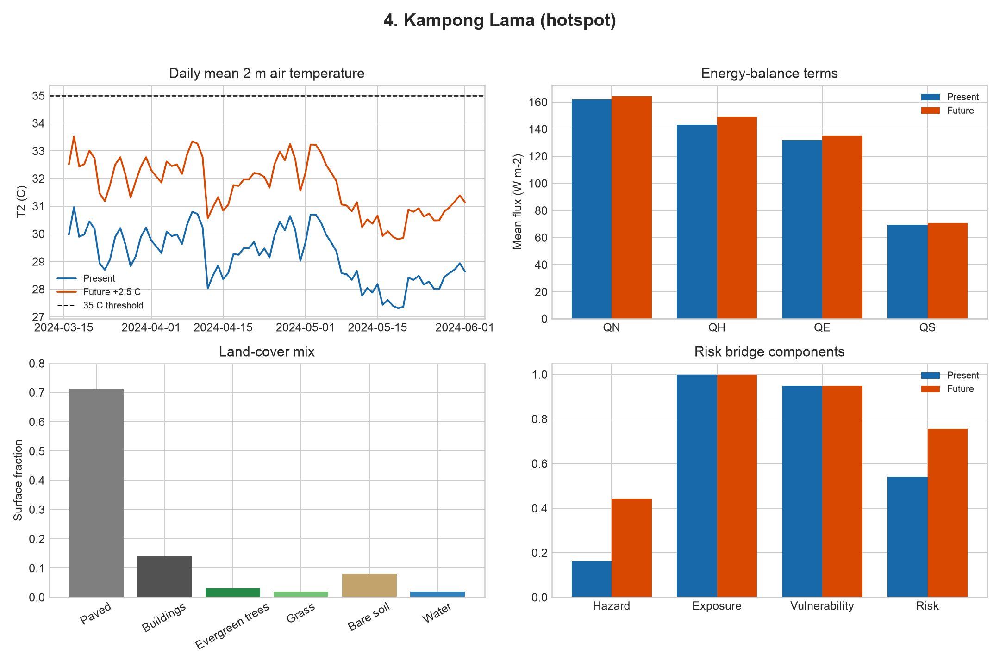

**Site description.** This site combines dense population, low AC access and high outdoor work with sparse vegetation, so heat hazard translates strongly into social risk.

Physical form: plan building fraction 0.14, frontal-area index 0.08, mean building height 6.3 m. Land cover is 71% paved, 14% buildings, 5% vegetated surfaces, 8% bare soil and 2% water.

Socio-economic profile: daytime population density is 300.0 people/ha and night-time density is 400.0 people/ha. Vulnerability proxies are over-65 7%, under-5 13%, AC access 8%, outdoor workers 62% and deprivation index 0.82.

Climatological result: mean analysis-window T2 rises from 29.2 C to 31.7 C; maximum hourly T2 rises from 35.7 C to 38.6 C. Mean sensible heat flux QH changes from 143.1 to 149.1 W m-2, while latent heat flux QE changes from 131.9 to 135.4 W m-2.

Heat-risk result: dangerous-heat hours increase from **6** to **103**. The risk index changes from **0.54** (#3) to **0.76** (#3). Components in the future scenario are hazard 0.44, exposure 1.00 and vulnerability 0.95.

### 5. Dhobi Lines (hotspot)

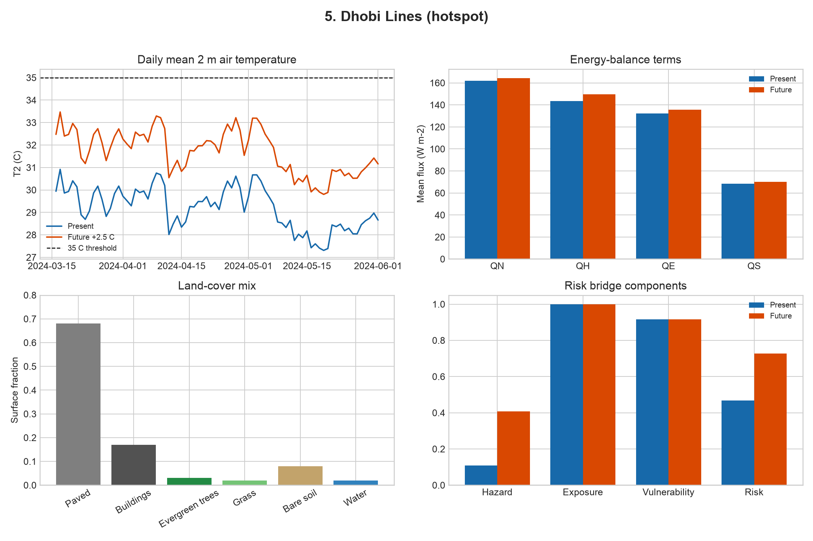

**Site description.** This site combines dense population, low AC access and high outdoor work with sparse vegetation, so heat hazard translates strongly into social risk.

Physical form: plan building fraction 0.17, frontal-area index 0.09, mean building height 9.1 m. Land cover is 68% paved, 17% buildings, 5% vegetated surfaces, 8% bare soil and 2% water.

Socio-economic profile: daytime population density is 300.0 people/ha and night-time density is 400.0 people/ha. Vulnerability proxies are over-65 8%, under-5 12%, AC access 10%, outdoor workers 60% and deprivation index 0.80.

Climatological result: mean analysis-window T2 rises from 29.2 C to 31.7 C; maximum hourly T2 rises from 35.6 C to 38.5 C. Mean sensible heat flux QH changes from 143.6 to 149.7 W m-2, while latent heat flux QE changes from 132.2 to 135.6 W m-2.

Heat-risk result: dangerous-heat hours increase from **4** to **96**. The risk index changes from **0.47** (#4) to **0.73** (#4). Components in the future scenario are hazard 0.41, exposure 1.00 and vulnerability 0.92.

### 6. Lusitano Square (core)

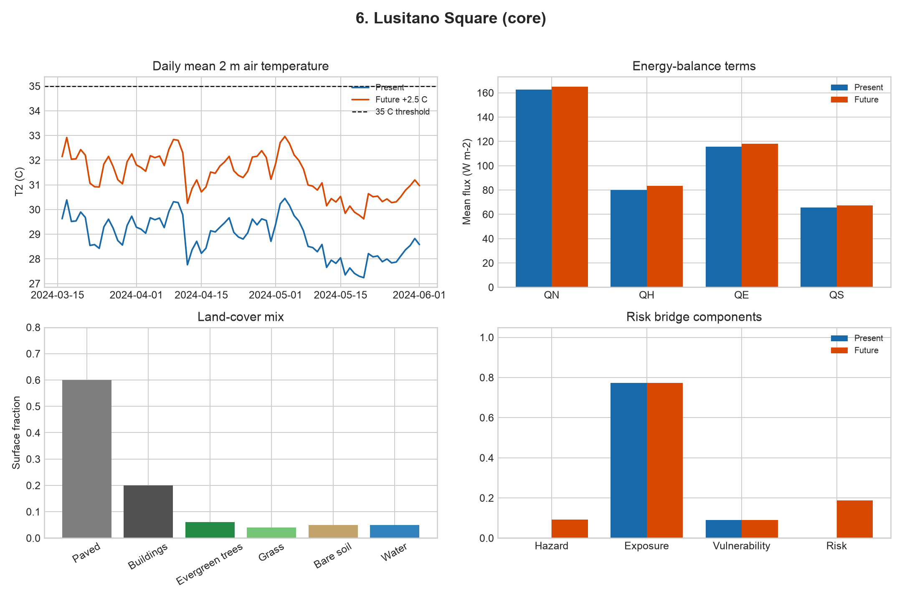

**Site description.** This site has substantial daytime exposure but lower vulnerability proxies, so risk depends strongly on whether the physical heat hazard crosses the threshold.

Physical form: plan building fraction 0.20, frontal-area index 0.30, mean building height 18.1 m. Land cover is 60% paved, 20% buildings, 10% vegetated surfaces, 5% bare soil and 5% water.

Socio-economic profile: daytime population density is 250.0 people/ha and night-time density is 130.0 people/ha. Vulnerability proxies are over-65 13%, under-5 7%, AC access 70%, outdoor workers 22% and deprivation index 0.30.

Climatological result: mean analysis-window T2 rises from 28.9 C to 31.4 C; maximum hourly T2 rises from 34.3 C to 36.9 C. Mean sensible heat flux QH changes from 80.0 to 83.5 W m-2, while latent heat flux QE changes from 115.8 to 118.0 W m-2.

Heat-risk result: dangerous-heat hours increase from **0** to **35**. The risk index changes from **0.00** (#5) to **0.19** (#6). Components in the future scenario are hazard 0.09, exposure 0.77 and vulnerability 0.09.

### 7. Mlima Moto (hotspot)

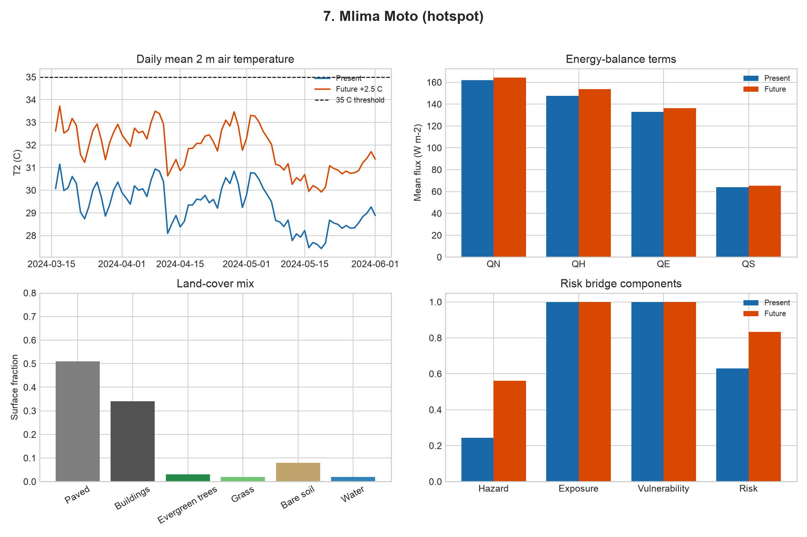

**Site description.** This site combines dense population, low AC access and high outdoor work with sparse vegetation, so heat hazard translates strongly into social risk.

Physical form: plan building fraction 0.34, frontal-area index 0.90, mean building height 10.2 m. Land cover is 51% paved, 34% buildings, 5% vegetated surfaces, 8% bare soil and 2% water.

Socio-economic profile: daytime population density is 300.0 people/ha and night-time density is 400.0 people/ha. Vulnerability proxies are over-65 7%, under-5 14%, AC access 6%, outdoor workers 65% and deprivation index 0.85.

Climatological result: mean analysis-window T2 rises from 29.3 C to 31.9 C; maximum hourly T2 rises from 36.3 C to 39.3 C. Mean sensible heat flux QH changes from 147.5 to 153.6 W m-2, while latent heat flux QE changes from 133.0 to 136.4 W m-2.

Heat-risk result: dangerous-heat hours increase from **9** to **126**. The risk index changes from **0.63** (#2) to **0.83** (#2). Components in the future scenario are hazard 0.56, exposure 1.00 and vulnerability 1.00.

### 8. Victoria Exchange (core)

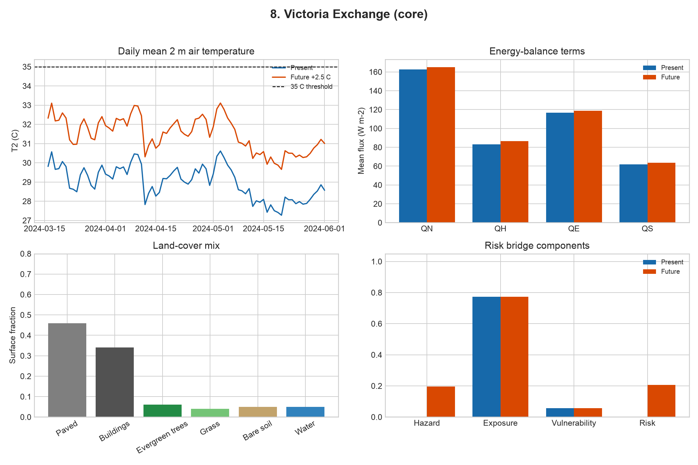

**Site description.** This site has substantial daytime exposure but lower vulnerability proxies, so risk depends strongly on whether the physical heat hazard crosses the threshold.

Physical form: plan building fraction 0.34, frontal-area index 0.21, mean building height 18.7 m. Land cover is 46% paved, 34% buildings, 10% vegetated surfaces, 5% bare soil and 5% water.

Socio-economic profile: daytime population density is 250.0 people/ha and night-time density is 130.0 people/ha. Vulnerability proxies are over-65 14%, under-5 6%, AC access 72%, outdoor workers 20% and deprivation index 0.28.

Climatological result: mean analysis-window T2 rises from 29.0 C to 31.5 C; maximum hourly T2 rises from 35.0 C to 37.6 C. Mean sensible heat flux QH changes from 83.1 to 86.6 W m-2, while latent heat flux QE changes from 116.5 to 118.7 W m-2.

Heat-risk result: dangerous-heat hours increase from **0** to **55**. The risk index changes from **0.00** (#5) to **0.21** (#5). Components in the future scenario are hazard 0.20, exposure 0.77 and vulnerability 0.06.

### 9. Fuzhou Lanes (hotspot)

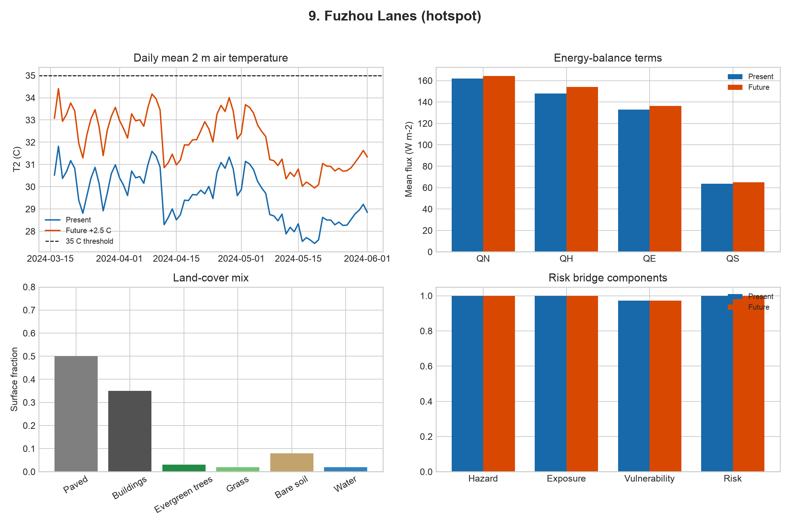

**Site description.** This site combines dense population, low AC access and high outdoor work with sparse vegetation, so heat hazard translates strongly into social risk.

Physical form: plan building fraction 0.35, frontal-area index 0.59, mean building height 5.9 m. Land cover is 50% paved, 35% buildings, 5% vegetated surfaces, 8% bare soil and 2% water.

Socio-economic profile: daytime population density is 300.0 people/ha and night-time density is 400.0 people/ha. Vulnerability proxies are over-65 8%, under-5 13%, AC access 7%, outdoor workers 63% and deprivation index 0.83.

Climatological result: mean analysis-window T2 rises from 29.6 C to 32.1 C; maximum hourly T2 rises from 38.0 C to 41.0 C. Mean sensible heat flux QH changes from 147.8 to 153.9 W m-2, while latent heat flux QE changes from 132.9 to 136.4 W m-2.

Heat-risk result: dangerous-heat hours increase from **37** to **211**. The risk index changes from **1.00** (#1) to **1.00** (#1). Components in the future scenario are hazard 1.00, exposure 1.00 and vulnerability 0.97.

### 10. Zheng He Towers (core)

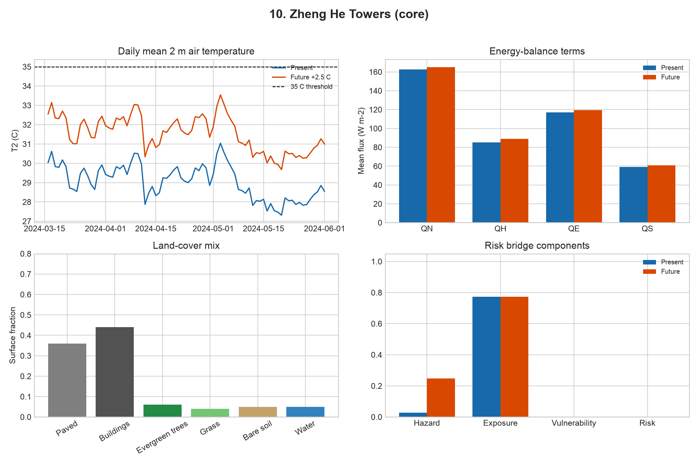

**Site description.** This site has substantial daytime exposure but lower vulnerability proxies, so risk depends strongly on whether the physical heat hazard crosses the threshold.

Physical form: plan building fraction 0.44, frontal-area index 0.39, mean building height 25.5 m. Land cover is 36% paved, 44% buildings, 10% vegetated surfaces, 5% bare soil and 5% water.

Socio-economic profile: daytime population density is 250.0 people/ha and night-time density is 130.0 people/ha. Vulnerability proxies are over-65 15%, under-5 6%, AC access 78%, outdoor workers 18% and deprivation index 0.25.

Climatological result: mean analysis-window T2 rises from 29.1 C to 31.6 C; maximum hourly T2 rises from 35.1 C to 37.7 C. Mean sensible heat flux QH changes from 85.3 to 88.8 W m-2, while latent heat flux QE changes from 117.1 to 119.3 W m-2.

Heat-risk result: dangerous-heat hours increase from **1** to **65**. The risk index changes from **0.00** (#5) to **0.00** (#7). Components in the future scenario are hazard 0.25, exposure 0.77 and vulnerability 0.00.

## Caveats and Interpretation

- SUEWS estimates environmental heat hazard, not observed health impact.
- The socio-economic dataset is synthetic; rankings are meaningful within UDA-city, but absolute values should not be treated as survey evidence.
- The 35 C dry-bulb threshold is simple and transparent, but it does not capture humidity stress directly. In this hot-humid setting, apparent temperature or wet-bulb-based metrics would be scientifically stronger.
- Min-max scaling makes the index relative to these ten neighbourhoods. Adding or removing neighbourhoods would change the scaled hazard, exposure and vulnerability values.
- The future scenario is a controlled +2.5 C pseudo-warming, not a downscaled climate projection.
- The compatibility run should be rerun with the dataset-recommended SuPy version before treating the numerical results as final.

## SUEWS Citation

Järvi, L., Grimmond, C.S.B. & Christen, A. (2011). The Surface Urban Energy and Water Balance Scheme (SUEWS): Evaluation in Los Angeles and Vancouver. *Journal of Hydrology*, 411(3-4), 219-237. https://doi.org/10.1016/j.jhydrol.2011.10.001

Ward, H.C., Kotthaus, S., Järvi, L. & Grimmond, C.S.B. (2016). Surface Urban Energy and Water Balance Scheme (SUEWS): Development and evaluation at two UK sites. *Urban Climate*, 18, 1-32. https://doi.org/10.1016/j.uclim.2016.05.001
